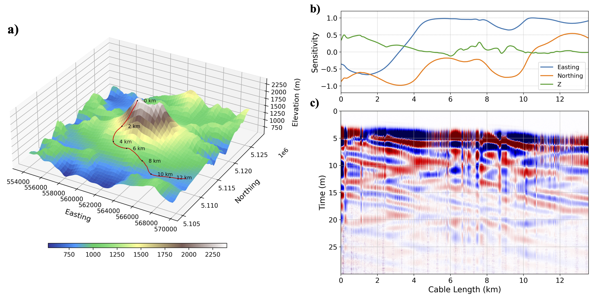

# GenericCable
Generic cable class for Distributed Acoustic Sensing (DAS) data modeling (forward) and inversion (adjoint). 


## Installation
Download the code from the repository:
```bash
git clone https://github.com/seisfwi/GenericCable
```

Install the package:
```bash
cd GenericCable

pip install .
```

## Examples
Read the examples in the `examples` folder to get started with the package.


## Main Features
1. Deal with irregular fiber geometry
2. Forward modeling of DAS data based on SPECFEM3D
3. Full-waveform inversion of DAS data
4. Smart DAS cable design for imaging and monitoring


## Future Features
1. Full-waveform moment-tensor inversion
2. Field-data examples

## Known Limitations
1. The coupling between the fiber and the subsurface is not considered
2. The pulse sent into the fiber is assumed to be a delta function for the current version
3. The change in the fiber properties due to the subsurface is not considered

## License
This project is licensed under the MIT License - see the [LICENSE](LICENSE) file for details.

## Acknowledgments
I would like to thank Stanford Earth imaging Project (SEP) affiliate companies and acknowledge helpful discussions with Dr. Milad Bader.

## References
To be added